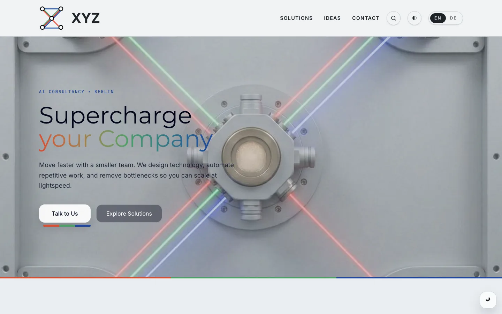
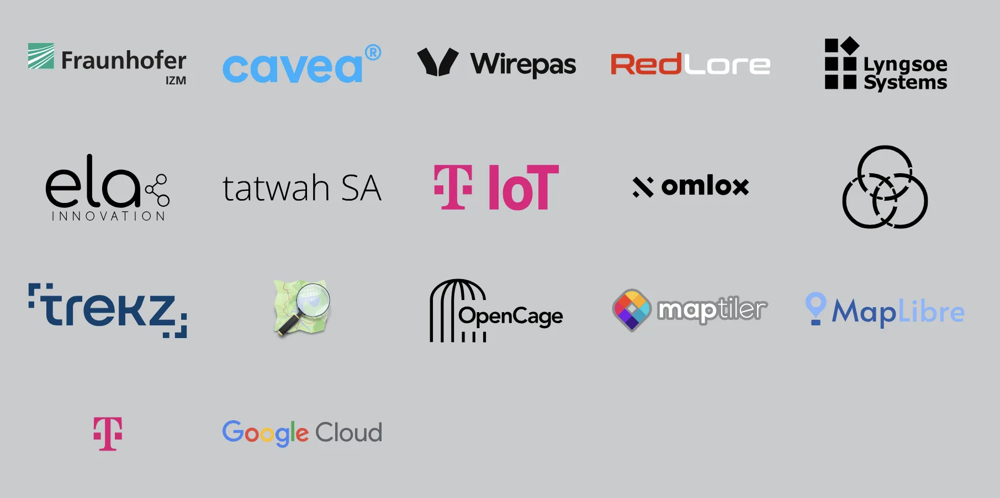
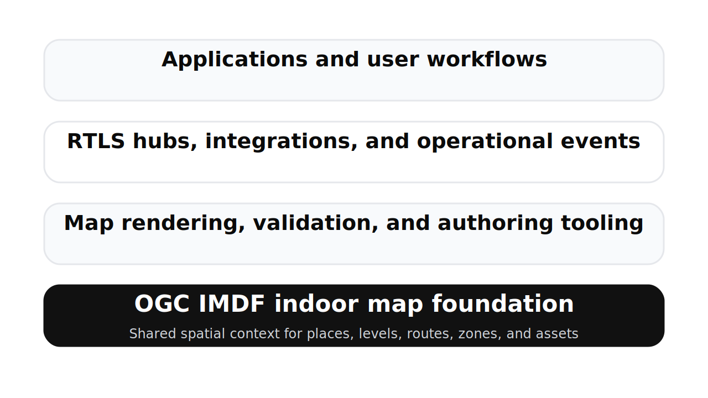
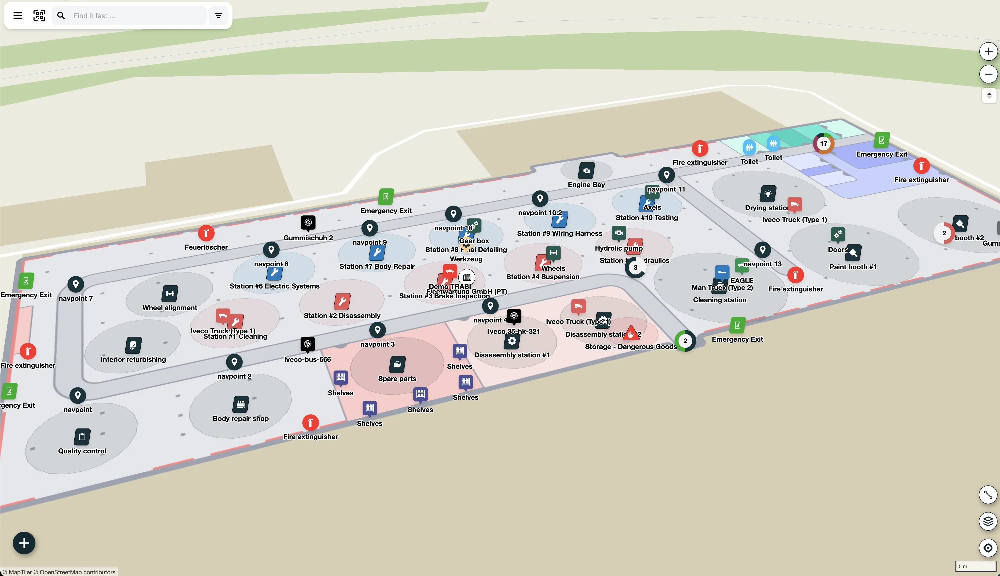
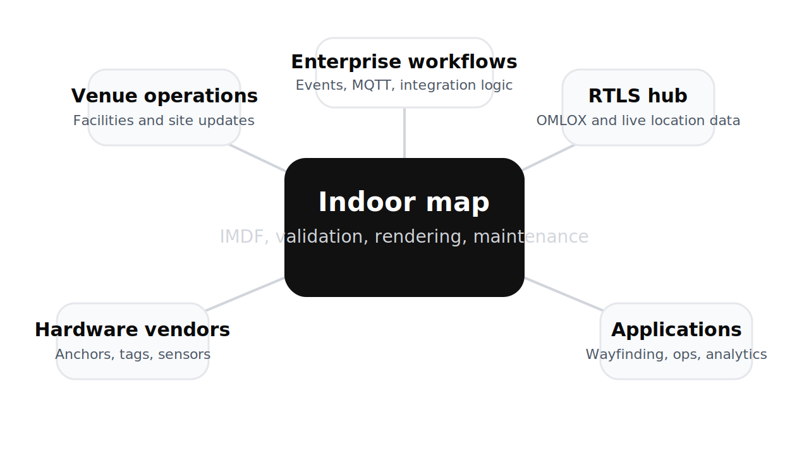

<!-- .slide: class="title-slide" -->

<section class="title-layout">
  

    <h1>Open RTLS for Indoor Mapping</h1>
    <h2>GEOIT 2026</h2>
  

  

    

      <h3>Jilles van Gurp</h3>
    

    

      
    

  

  

    
A mapping-first strategy for interoperable Real-Time Location Systems (RTLS)

    

      

        

          
          <a href="https://open-rtls.com">open-rtls.com</a>
        

      

      

        

          
          <a href="https://tryformation.com">tryformation.com</a>
        

      

      

        

          
          <a href="https://formationxyz.com">formationxyz.com</a>
        

      

    

  

</section>

---
## Who are we

  

    
    

      <h3>tryformation.com</h3>
      
Real-time location intelligence for physical operations, with a live operational map of assets, locations, and activity.

    

  

  

    
    

      <h3>formationxyz.com</h3>
      
Our consulting and solution engineering branch for practical AI work with real customers. We use it to experiment with agentic systems, Openclaw, and automation in production settings, then feed those learnings back into our core products.

    

  

  <h3>3 Dudes with Laptops</h3>
  

    

      <strong>Ian Hannigan</strong>
      
CEO

    

    

      <strong>Jilles van Gurp</strong>
      
CTO

    

    

      <strong>Jacob Otto</strong>
      
Lead Engineer

    

  

---
## Groundhog Day

Integrating real-time location system (RTLS) hardware means doing the same types of integrations over and over again.

  

    <h3>Everyone reinvents the same wheels</h3>
    <ul>
      <li>Indoor maps and mapping platforms rebuilt vendor by vendor</li>
      <li>No standard mapping formats across deployments</li>
      <li>Many RTLS companies still rely on bitmaps</li>
    </ul>
  

  

    <h3>RTLS IoT hubs are all different</h3>
    <ul>
      <li>Every vendor has their own hub model</li>
      <li>Walled gardens built around SDKs and proprietary technology</li>
      <li>Low interoperability and hard vendor lock-in</li>
    </ul>
  

  

    <h3>The result is predictable</h3>
    <ul>
      <li>High-cost, vendor-specific integrations</li>
      <li>Poor UX and ugly maps</li>
      <li>Wasted time on non-differentiating infrastructure</li>
    </ul>
  

> Too much effort goes into rebuilding plumbing instead of delivering usable location products.

---
## Partners we work with

Over the years, FORMATION has built up a network of partners that spans the whole of the RTLS ecosystem: everything from QR codes, bar code scanners, GPS, Bluetooth, UWB, to IOT middleware.

<!-- .slide: class="rtls-intro-slide" -->
---
## What is RTLS?

RTLS stands for <strong>Real-Time Location Systems</strong>.

  

    <h3>Not one technology</h3>
    
RTLS spans UWB, BLE, RFID, Wi-Fi, GPS, QR workflows, and hybrids.

  

  

    
  

  

    <h3>Indoor GPS alternative</h3>
    
Where are things now, and how is that changing when GPS is weak or unavailable?

  

  

    <h3>Business value comes later</h3>
    
Coordinates are not enough. Value comes from search, zones, paths, alerts, navigation, and workflow decisions.

  

> RTLS becomes usable when location data is tied to a shared model of places, floors, zones, and assets.

<!-- .slide: class="why-open-slide" -->
---
## Why Open RTLS is needed

  

    <h3>RTLS projects are still too bespoke</h3>
    <ul>
      <li>High CapEx and long deployments</li>
      <li>Accuracy, coverage, and adoption miss expectations</li>
      <li>Teams rebuild the same integration layer</li>
    </ul>
  

  

    
  

  

    <h3>Most stacks optimize for feeds, not context</h3>
    <ul>
      <li>Vendors expose coordinates and events</li>
      <li>Integrators still need places, floors, zones, and map UX</li>
      <li>Every project remaps the same reality</li>
    </ul>
  

  

    <h3>Open RTLS targets the missing layer</h3>
    <ul>
      <li>Shared map workflows and validation</li>
      <li>Portable interfaces around standards</li>
      <li>Less plumbing, faster products</li>
    </ul>
  

> The real question is not “what are the coordinates?” but “is the asset in the right place at the right time?”

---
## Why start with indoor mapping?

Indoor mapping is the substrate the rest of the RTLS stack depends on.

  

    <h3>Shared context</h3>
      
Places, levels, anchors, assets, routes, and zones need a common spatial model.

  

  

    <h3>Better interoperability</h3>
    
A strong venue model makes hubs, SDKs, and downstream apps easier to integrate.

  

  

    <h3>Operational leverage</h3>
    
Validation, authoring, and map updates become reusable product capabilities.

  

---
## What is IMDF?

IMDF stands for <strong>Indoor Mapping Data Format</strong>.

A practical, structured indoor map format for exchanging venue geometry, semantics, and floor-level context.

  

    

      
Model

      <h3>OGC indoor map model</h3>
      
Standardized features for buildings, footprints, levels, units, and navigation context.

    

    

      
Format

      <h3>GeoJSON-based and portable</h3>
      
Reusable map data instead of bitmap floorplans and one-off overlays per product.

    

    

      
Proof

      <h3>Already used in products</h3>
      
Platforms such as Microsoft Places already expect IMDF-style indoor map workflows.

    

  

  <figure class="imdf-visual-frame">
    
    <figcaption>Indoor geometry becomes operational when zones, assets, exits, and work areas all reference the same map model.</figcaption>
  </figure>

> IMDF is not just a schema to store maps; it is a practical interchange format that real platforms already expect.

---
## Standards alignment

Open RTLS is mapping-first, but standards-aligned across the stack.

  

    <h3>OGC IMDF</h3>
      
The primary indoor mapping model for structured, portable venue data.

    
Authoring, validation, rendering, and product integrations start here.

  

  

    <h3>OMLOX</h3>
    
Location data exchange for interoperable RTLS hubs and map-aware applications.

    
Important, but downstream from the map model.

  

  

    <h3>MQTT</h3>
    
Real-time transport for telemetry, events, and updates flowing around the map.

    
Useful glue for live operational systems.

  

---
## The strategic shift

Move from bespoke project-by-project tooling to shared open infrastructure.

  

    <h3>Typical model today</h3>
    
Custom map prep

    
Vendor-specific adapters

    
Ad hoc validation

    
One-off app integration

  

  
→

  

    <h3>Open RTLS model</h3>
    
Reusable IMDF workflows

    
Standards-aligned interfaces

    
Shared validation and SDKs

    
Faster delivery for everyone

  

> The goal is not to replace standards or existing systems, but to reduce duplicated integration work around them.

---
## Maps stop at the front door

Most venues are empty polygons on the outdoor map. Indoor maps provide the missing detail.

  

    

      <h3>Extend outdoor use cases indoor</h3>
      
Search, explore, and routing should continue seamlessly once you enter the venue.

    

    

      <h3>Operational context</h3>
      
The indoor map ties together zoning, moving assets and inventory, key infrastructure, and points of interest to provide situational awareness.

    

  

  

---
## Georeferencing is more relative than people think

Indoor maps are often aligned against outdoor basemaps, but those basemaps do not perfectly agree with each other.

  

    <h3>What we observed</h3>
    <ul>
      <li>OpenStreetMap, Google, Here, and Apple can disagree by roughly 1 to 4 meters on the same reference point</li>
      <li>That is enough to make high-precision indoor paths appear to cut through walls</li>
      <li>We had one case where shifting the map by about 1.5 meters fixed the operational view</li>
    </ul>
  

  

    <h3>Why it matters for Open RTLS</h3>
    <ul>
      <li>Georeferencing is not just a one-time graphics task</li>
      <li>Map truth has to line up with positioning truth</li>
      <li>Editors and validators should help teams manage this explicitly</li>
    </ul>
  

> For indoor RTLS, aligning the map with the tracking system is often more important than aligning perfectly with any single outdoor basemap.

---
## Planned mapping-focused components

  

    <h3>OGC IMDF Editor</h3>
    
Practical tooling for creating and maintaining indoor map data with operational workflows.

  

  

    <h3>IMDF Validator</h3>
    
Standards-aligned checks that catch data issues before deployments break in production.

  

  

    <h3>MapLibre IMDF Map SDK</h3>
    
Map rendering and application building blocks for venue-aware user experiences.

  

  

    <h3>Connector Framework</h3>
    
Bridges mapping workflows to hubs, devices, enterprise systems, and site-specific realities.

  

---
## How the map connects the ecosystem

Indoor maps create the common operating picture between:

- venue operations
- RTLS hubs and hardware vendors
- enterprise workflows
- user-facing map applications

---
## 2026 roadmap

  

    <h3>March 2026</h3>
    
Website launch, outreach, requirements gathering, and early prototypes.

  

  

    <h3>Spring 2026</h3>
    
First releases focused on practical mapping and integration components.

  

  

    <h3>Summer 2026</h3>
    
OMLOX Plugfest demos, roadmap revision, and clearer path toward a 1.0 foundation.

  

For this audience, the near-term emphasis is:

- IMDF workflows
- better map quality
- faster geospatial integration

---
## What this means for the market

  

    <h3>Integrators</h3>
    
Less bespoke plumbing, faster delivery, and clearer interoperability.

  

  

    <h3>Vendors</h3>
    
Shared infrastructure for non-differentiating layers around maps and integration.

  

  

    <h3>Venue owners</h3>
    
Higher map quality, easier lifecycle management, and more portable data.

  

---
## What we need now

Open RTLS is currently in the requirements gathering phase.

  

    <h3>Most valuable input</h3>
    <ul>
      <li>Real indoor mapping use cases</li>
      <li>Current toolchain constraints</li>
      <li>Integration blockers between maps and RTLS systems</li>
      <li>Operational pain points in map maintenance</li>
    </ul>
  

  

    <h3>How to engage</h3>
    <ul>
      <li>Pilot users</li>
      <li>Standards and workflow feedback</li>
      <li>Contributor interest</li>
      <li>Partner conversations</li>
    </ul>
  

[open-rtls.com](https://open-rtls.com)

[open-rtls@tryformation.com](mailto:open-rtls@tryformation.com)

---
## Appendix: positioning and governance

- Open RTLS is initiated by FORMATION GmbH
- The goal is interoperability, not replacing standards
- Existing OMLOX hubs can remain part of the architecture
- Mapping, validation, SDKs, and connectors address the broader integrator reality
- Governance can evolve over time based on stakeholder feedback

> The immediate goal is a solid open foundation that people can evaluate, use, and improve.
